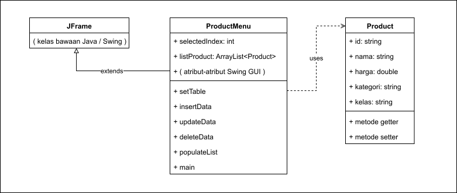
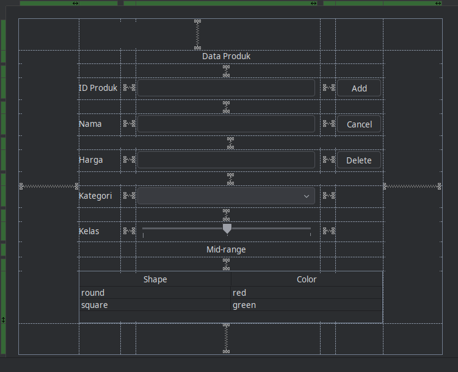
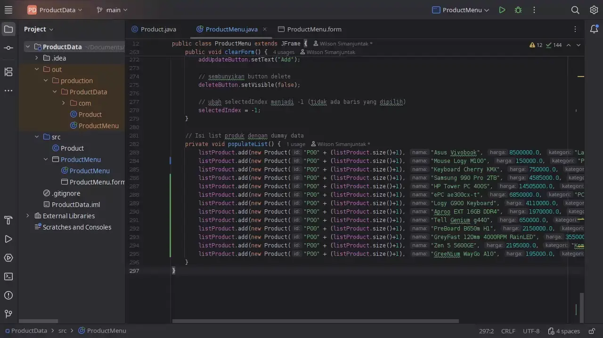

# Tugas Praktikum DPBO #4

Dibuat untuk menyelesaikan TP4 Desain Pemrograman Berorientasi Objek (DPBO)

## Janji

Saya Willsoon Tulus Parluhutan Simanjuntak dengan NIM 2404756 mengerjakan evaluasi Tugas Praktikum 4 dalam mata kuliah Desain Pemrograman Berorientasi Objek untuk keberkahanNya maka saya tidak melakukan kecurangan seperti yang telah dispesifikasikan. 

Aamiin.

## Desain program

Diagram UML:

Desain Swing GUI:

## Penjelasan Alur jalan program

Program ini menggunakan Swing UI sebagai antarmuka pengoperasiannya, dan diawali dengan berbagai data dummy yang telah terisi sejak program dijalankan.

## Preview operasional program

